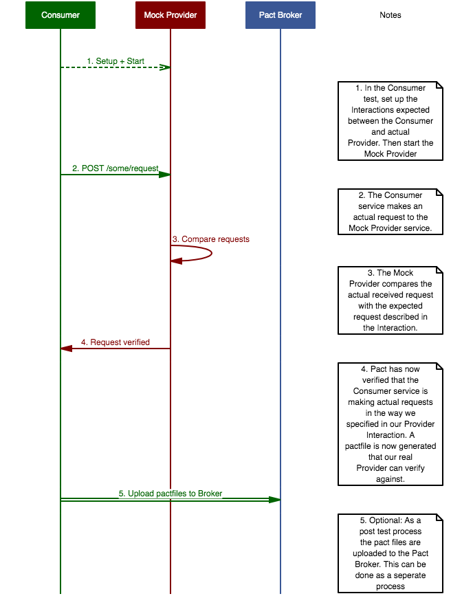
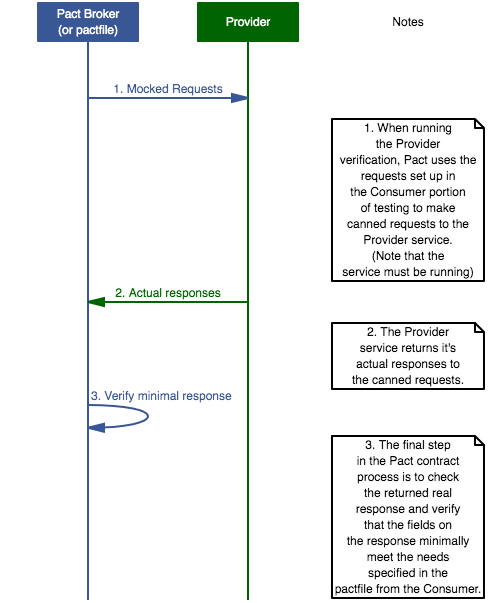

# Merrill Typescript Pact.io Proof of Concept

This repo exists as an example of implementing a consumer-provider pair in [pact.io](https://docs.pact.io).

- [Merrill Typescript Pact.io Proof of Concept](#merrill-typescript-pactio-proof-of-concept)
  - [Quick Start](#quick-start)
  - [Breaking the Pact](#breaking-the-pact)
    - [What the Failure Means](#what-the-failure-means)
  - [The Pact Broker](#the-pact-broker)
    - [Running the Broker](#running-the-broker)
  - [The Pact Matrix](#the-pact-matrix)
  - [Conclusion](#conclusion)
  - [Additional Details](#additional-details)
    - [PoC Provider and Consumer Schema](#poc-provider-and-consumer-schema)
    - [Consumer Test Sequence Diagram](#consumer-test-sequence-diagram)
    - [Provider Test Sequence Diagram](#provider-test-sequence-diagram)

## Quick Start

To install dependencies for these projects run the following npm command:
```
npm run init
```

Then run the services (auto-reload is enabled):
```
npm start
```

In another terminal, you will be able to hit a Consumer endpoint to kick off a request to the Provider, like so:
```
curl localhost:3000/pact (Makes a POST to the Provider)
```

The Provider service will return a response to the Consumer service, which will then be logged:
```
{"data":"Some request","count":7}
```


Now that we know the two services can interact, we can run the pact tests. We can set up a contract between the Consumer and Provider by first running the Consumer pact test to generate a `pactfile`. Then we'll run the Provider pact test to verify that the Provider meets the Consumer needs specified in the `pactfile`
```
npm run pact:all
```

**Note**: Keep in mind that the provider service must be running while running the pact tests.


If you'd like to run the tests seperately, you can do:
```
npm run pact:consumer
npm run pact:provider
```

----------
## Breaking the Pact
Now we need to know that we can cause these tests to fail by breaking the schema. Locally, go into the [provider](./provider/src/provider) folder and modify [provider.controller.ts](./provider/src/provider/provider.controller.ts) to change the http return code to be `201`.
```ts
@HttpCode(200) -> @HttpCode(201)
```
Save, and give the other terminal window a few seconds to reload the new changes.

After doing this, re-run the provider portion of the pact test:
```
npm run pact:provider
```

When the provider runs (i.e. `npm run pact:provider`) you will see a failure, with tons of logging goodness!

### What the Failure Means
Here, our pact test failed because the contract was broken by the Provider. There are two scenarios where pact contract tests will fail:
- The Provider pushes changes that remove/change expected return fields, field types, or headers. In this case, the Provider is running against an already generated pactfile and fails.
- The Consumer pushes new code that changes the way that it makes the request to the provider. In this case, the Consumer runs its pact test suite and generates new pact files. The pact broker (a running service not included in this poc) reaches out to providers of this Consumer and kicks off new builds. The new builds run their provider tests against the new pactfile and fail because of the unexpected request.

--------
## The Pact Broker
Working with `pactfiles` is great and all, but what do you do when the Provider and Consumer services are maintained by different teams? Should you just email the `pactfiles` back and forth to do the contract tests?

Luckily Pact has a service available that automates the `pactfile` comparison and management called a Pact Broker. The broker is built on Ruby and Postgress, and provides the following awesome features (taken from the [broker github page](https://github.com/pact-foundation/pact_broker)):

- A RESTful API for publishing and retrieving pacts.
- An embedded API browser for navigating the API.
- Autogenerated documentation for each pact.
- Dynamically generated network diagrams so you can visualise your microservice network.
- Displays provider verificaton results so you know if you can deploy safely.
- Provides a "matrix" of compatible consumer and provider versions, so you know which versions can be safely deployed together.
- Provides badges to display pact verification statuses in your READMEs.
- Enables an application version to be tagged (ie. "prod", "feat/customer-preferences") to allow repository-like workflows.
- Provides webhooks to trigger actions when pacts change eg. run provider build, notify a Slack channel.
- View diffs between Pact versions so you can tell what expectations have changed.
- [Docker Pact Broker](https://hub.docker.com/r/dius/pact-broker) (Used in this PoC)
- A [CLI](https://github.com/pact-foundation/pact-ruby-standalone/releases) for encorporating the Pact workflow into your continuous integration process.

### Running the Broker
First, stop your running terminals from the previous sections.

To start the Broker, ensure you have the following installed:
- [Docker](https://www.docker.com/)
- [Docker Compose](https://docs.docker.com/compose/)

If on Mac, you will also need the `timeout` or `gtimeout` function, which you can get with `brew install coreutils`

Once you have the prerequisites installed, run the following command in a new terminal:
```
docker-compose up
```

Docker will download and setup containers for both Postgress and the Pact Broker. You can now go to http://localhost:80 in your browser and you will see the broker app. However, there will not be anything listed.

To get contracts into the broker, go to [config.ts](./config.ts) and change the `usePactBroker` setting to `true`.

Now, start the services up again in a new terminal window, like so:
```
npm start
```

And now, in a third terminal window, run all the pact tests:
```
npm run pact:all
```

This command will now do 3 things:

1. Run the Consumer contract tests and generate the `pactfile`s.
2. Publish the `pactfile`s to the Pact Broker.
3. Run the Provider verification tests against the broker and generate the Pact contracts.

Go back to your [browser window](http://localhost:80) with the Broker open. You will now see a contract listed between the `Consumer` and `Provider` services.

--------
## The Pact Matrix
The Pact Broker gives you the ability to see what versions of services work together. To see this in play, lets break the contract again.

Go into [config.ts](./config.ts) and change the following lines on the provider:
```ts
public static providerVersion = '2.0.0'; -> public static providerVersion = '2.0.1'
public static providerStatusCode = 200;  -> public static providerStatusCode = 201
```

Wait for the services to reload, and then run the pact tests:
```
npm run pact:all
```

You will see a failure, and if you go back into the broker in your browser, the contract will show up in red to represent that the interaction has been broken.

you will see a little symbol in the contract that looks like a grid, if you click on it, it will take you to the Pact Matrix for that contract. The Matrix will show that:
```
Consumer v2.0.0 doesn't work with Provider v2.0.1
Consumer v2.0.0 works with Provider v2.0.0
```

Finally, let's update the Consumer to expect the correct new status code response from the Provider.

Change the following lines in [config.ts](./config.ts):
```ts
public static consumerVersion = '2.0.0'; -> public static consumerVersion = '2.0.1';
public static consumerStatusCode = 200;  -> public static consumerStatusCode = 201;
```

Wait for the services to reload, and then run the pact tests:
```
npm run pact:all
```

Refresh the page with the pact matrix and it will give you even better details on which versions will successfully run together.
```
Consumer v2.0.1 works with Provider v2.0.1
Consumer v2.0.0 doesn't work with Provider v2.0.1
Consumer v2.0.0 works with Provider v2.0.0
```
---------
## Conclusion

Hopefully this has been a decent run through of pact.io and has made the tool easier to understand. 

If you have any additional suggestions for this PoC or would like to talk more about pact.io, slack or email Joel Milligan at joel.milligan@meriillcorp.com. :)

----------
## Additional Details

### PoC Provider and Consumer Schema
Here is the expected response of our Provider in this example:
```ts
interface ProviderResponse {
  data: string;
  count: number;
}
```
And here is the request body that is `POST`ed to our Provider:
```ts
interface ConsumerRequest {
  request: string;
}
```

If you were to change the type of returned data it would cause the pact tests to fail.

### Consumer Test Sequence Diagram


### Provider Test Sequence Diagram

